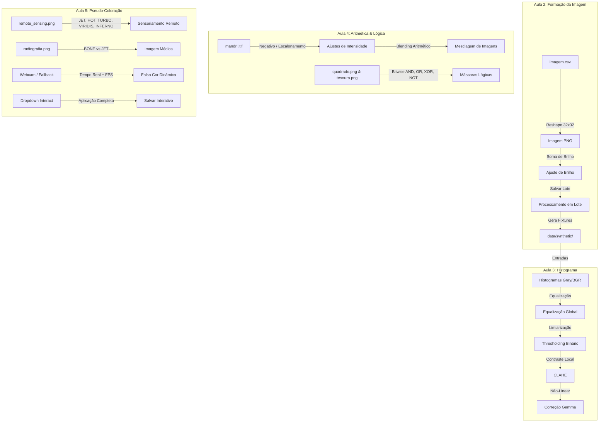

# Processamento Digital de Imagens

Repositório de experimentos práticos e roteiros pedagógicos de Processamento Digital de Imagens (PDI).

[](https://github.com/thalesfb/digital-image-processing/actions/workflows/ci.yml)
[](https://github.com/thalesfb/digital-image-processing/releases)
[](requirements.txt)
[](requirements.txt)
[](commitlint.config.cjs)
[](LICENSE)

## Fluxo de Processamento e Integração

O diagrama abaixo ilustra a evolução dos experimentos e o fluxo de dados entre os laboratórios desenvolvidos neste repositório:



## Estrutura

```
digital-image-processing/
├── .githooks/              # git hooks
├── .venv/                  # ambiente Python (local)
├── commitlint.config.cjs     # regras de commit (Conventional Commits + gitmoji)
├── docs/
│   ├── EXECUTION.md        # guia passo a passo dos notebooks
│   └── GIT_HOOKS.md        # convenção de commits
├── experiment/
│   ├── Aula 2/             # Formação da Imagem
│   ├── Aula 3/             # Histograma
│   ├── Aula 4/             # Operações Lógicas e Aritméticas
│   └── Aula 5/             # Pseudo-Coloração
├── requirements.txt        # deps Python
├── package.json            # deps commitlint / hooks
└── scripts/
    ├── setup.ps1           # setup completo (Windows)
    ├── setup.sh            # setup completo (Linux/macOS)
    ├── activate.ps1        # ativa .venv na sessão atual
    ├── verify-env.ps1      # checagem rápida do ambiente
    └── git-hooks/          # fonte dos hooks
```

## Regra: sempre use o ambiente virtual

**Todo** comando Python (`python`, `pip`, `jupyter`) e **todo** notebook deve usar o `.venv` deste repositório — nunca o Python global do sistema.

```powershell
# Em cada nova sessão de terminal:
. .\scripts\activate.ps1          # ativa .venv (note o "." no início)
.\scripts\verify-env.ps1          # confirma que está correto
```

No Cursor/VS Code: o interpretador já aponta para `.venv` (`.vscode/settings.json`). Nos notebooks, use o kernel **PDI (.venv)**.

## Quick Start

**Pré-requisitos:** Python 3.11+, Node.js 20+, Git for Windows (com Git Bash).

```powershell
cd C:\dev\digital-image-processing
.\scripts\setup.ps1               # cria .venv (uma vez)
. .\scripts\activate.ps1          # ativa .venv (sempre)
.\scripts\verify-env.ps1
```

Abra [`experiment/Aula 2/notebook.ipynb`](experiment/Aula%202/notebook.ipynb) com kernel **PDI (.venv)**.

Guia detalhado: [`docs/EXECUTION.md`](docs/EXECUTION.md)

## Setup manual

### Ambiente Python

```powershell
python -m venv .venv
. .\scripts\activate.ps1
python -m pip install --upgrade pip
pip install -r requirements.txt
python -m ipykernel install --user --name=pd-images --display-name="PDI (.venv)"
```

> Após o setup, **sempre** ative o `.venv` antes de `pip`, `python` ou notebooks.

### Git hooks (commits)

```powershell
npm install
npm run hooks:install:win
```

Convenção: [`docs/GIT_HOOKS.md`](docs/GIT_HOOKS.md)

Formato: `:books: docs(aula2): add execution guide`

## Executar experimentos

1. **Ative o `.venv`** — `. .\scripts\activate.ps1` (obrigatório em todo terminal)
2. Abra o notebook da aula
3. Kernel **PDI (.venv)** (obrigatório — nunca use Python global)
4. Execute células em ordem (Partes 0–6)
5. Preencha células **Respostas**

### Aula 2 — Formação da Imagem

- Converter `imagem.csv` em PNG
- Transformação pontual (+100) em escala de cinza e colorida
- Processamento em lote de diretório

**Pastas:**

| Caminho | Conteúdo | Git |
|---------|----------|-----|
| `experiment/Aula 2/imagem.csv` | Fonte | versionado |
| `experiment/Aula 2/data/synthetic/` | Fixtures | opcional |
| `experiment/Aula 2/data/output/` | Saídas | ignorado |

## Commits

Hooks validam: ASCII, gitmoji shortcode, Conventional Commits, subject em inglês (72 chars).

```powershell
git commit -m ":sparkles: feat(aula2): add grayscale brighten pipeline"
```

Merge commits e `Revert` passam automaticamente.

## Integração Contínua e Releases (CI/CD)

Este repositório utiliza **GitHub Actions** para automação de testes e entregas:
- **Integração Contínua (CI):** Validação automática de todos os notebooks de forma headless (`scripts/run_ci_tests.py`) a cada push ou Pull Request para a branch `main`.
- **Releases Automáticos:** Ao criar e subir uma tag de versão (ex: `v1.0.0`), um release é gerado automaticamente no GitHub com notas de versão baseadas nos commits.

## Troubleshooting

| Problema | Solução |
|----------|---------|
| `ModuleNotFoundError: cv2` | `.venv` não ativo ou kernel errado — ative e use **PDI (.venv)** |
| Terminal sem `(.venv)` no prompt | Execute `. .\scripts\activate.ps1` |
| Commit rejeitado | Ver [`docs/GIT_HOOKS.md`](docs/GIT_HOOKS.md) |
| Hook não roda | `npm run hooks:install:win` + Git Bash instalado |
| Repo no Google Drive | Mova para `C:\dev\digital-image-processing` |

## Referências

- Notebooks de estudo: [machine_learning](https://github.com/thalesfb/machine_learning)
- **Guia de Desenvolvimento e Handoff:** [`AGENTS.md`](AGENTS.md)
