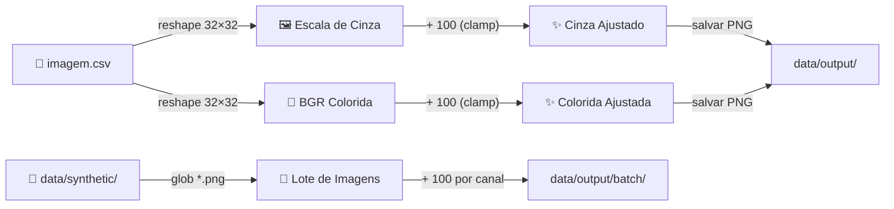
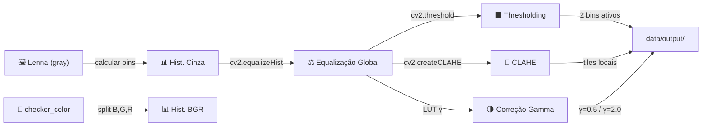
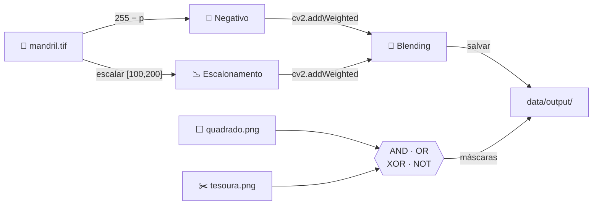
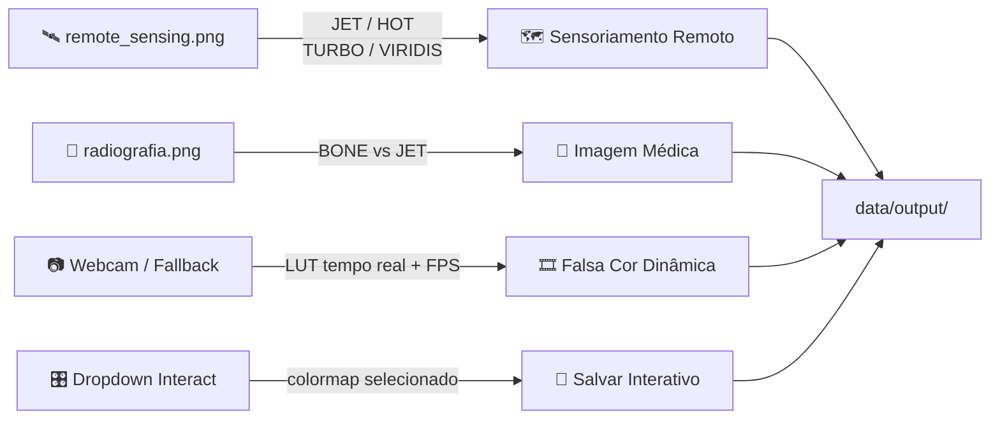

# Processamento Digital de Imagens

Repositório de experimentos práticos e roteiros pedagógicos de Processamento Digital de Imagens (PDI).

[](https://github.com/thalesfb/digital-image-processing/actions/workflows/ci.yml)
[](https://github.com/thalesfb/digital-image-processing/releases)
[](requirements.txt)
[](requirements.txt)
[](docs/GIT_HOOKS.md)
[](LICENSE)

---

## Experimentos

| Aula | Tema | Notebook |
|------|------|----------|
| 2 | Formação da Imagem | [`experiment/Aula 2/notebook.ipynb`](experiment/Aula%202/notebook.ipynb) |
| 3 | Histograma | [`experiment/Aula 3/notebook.ipynb`](experiment/Aula%203/notebook.ipynb) |
| 4 | Operações Lógicas e Aritméticas | [`experiment/Aula 4/notebook.ipynb`](experiment/Aula%204/notebook.ipynb) |
| 5 | Pseudo-Coloração | [`experiment/Aula 5/notebook.ipynb`](experiment/Aula%205/notebook.ipynb) |

---

## Pipelines por Experimento

### Aula 2 — Formação da Imagem



### Aula 3 — Histograma



### Aula 4 — Operações Aritméticas e Lógicas



### Aula 5 — Pseudo-Coloração



---

## Estrutura

```
digital-image-processing/
├── .githooks/              # git hooks ativos
├── .venv/                  # ambiente Python (local, não versionado)
├── commitlint.config.cjs   # regras de commit (Conventional Commits + gitmoji)
├── docs/
│   ├── EXECUTION.md        # guia passo a passo dos notebooks
│   ├── GIT_HOOKS.md        # convenção de commits
│   └── slides/             # PDFs das aulas (Aulas 01–05)
├── experiment/
│   ├── Aula 2/             # Formação da Imagem
│   ├── Aula 3/             # Histograma
│   ├── Aula 4/             # Operações Lógicas e Aritméticas
│   └── Aula 5/             # Pseudo-Coloração
├── requirements.txt        # dependências Python
├── package.json            # dependências commitlint / hooks
└── scripts/
    ├── setup.ps1           # setup completo (Windows)
    ├── setup.sh            # setup completo (Linux/macOS)
    ├── activate.ps1        # ativa .venv na sessão atual
    ├── verify-env.ps1      # checagem rápida do ambiente
    └── git-hooks/          # fonte dos hooks
```

---

## Quick Start

**Pré-requisitos:** Python 3.11+, Node.js 20+, Git for Windows (com Git Bash).

```powershell
cd C:\dev\digital-image-processing
.\scripts\setup.ps1               # cria .venv (uma única vez)
. .\scripts\activate.ps1          # ativa .venv (toda nova sessão)
.\scripts\verify-env.ps1          # confirma ambiente correto
```

> **Regra absoluta:** todo comando `python` / `pip` / Jupyter **deve** usar o `.venv` deste repositório — nunca o Python global.  
> No Cursor/VS Code o interpretador já aponta para `.venv` (`.vscode/settings.json`). Nos notebooks use o kernel **PDI (.venv)**.

Guia detalhado: [`docs/EXECUTION.md`](docs/EXECUTION.md)

---

## Setup manual

### Ambiente Python

```powershell
python -m venv .venv
. .\scripts\activate.ps1
python -m pip install --upgrade pip
pip install -r requirements.txt
python -m ipykernel install --user --name=pd-images --display-name="PDI (.venv)"
```

### Git hooks (validação de commits)

```powershell
npm install
npm run hooks:install:win
```

Formato obrigatório: `:sparkles: feat(aula2): add grayscale brighten pipeline`  
Referência completa: [`docs/GIT_HOOKS.md`](docs/GIT_HOOKS.md)

---

## Executar um experimento

1. **Ative o `.venv`** — `. .\scripts\activate.ps1` (obrigatório em todo terminal)
2. Abra o notebook da aula desejada
3. Selecione o kernel **PDI (.venv)**
4. Execute as células em ordem (Partes 0 → final)
5. Preencha as seções **Respostas**

---

## Integração Contínua e Releases (CI/CD)

- **CI:** Todos os notebooks são validados de forma headless via `scripts/run_ci_tests.py` a cada push / PR para `main`.
- **Release:** Uma tag `vX.Y.Z` gera automaticamente um release no GitHub com notas baseadas nos commits.

---

## Troubleshooting

| Problema | Solução |
|----------|---------|
| `ModuleNotFoundError: cv2` | `.venv` não ativo ou kernel errado — ative e use **PDI (.venv)** |
| Terminal sem `(.venv)` no prompt | Execute `. .\scripts\activate.ps1` |
| Commit rejeitado | Ver [`docs/GIT_HOOKS.md`](docs/GIT_HOOKS.md) |
| Hook não roda | `npm run hooks:install:win` + Git Bash instalado |
| Repo no Google Drive | Mova para `C:\dev\digital-image-processing` |

---

## Referências

- Notebooks de estudo: [machine_learning](https://github.com/thalesfb/machine_learning)
- **Guia de Desenvolvimento:** [`AGENTS.md`](AGENTS.md)
