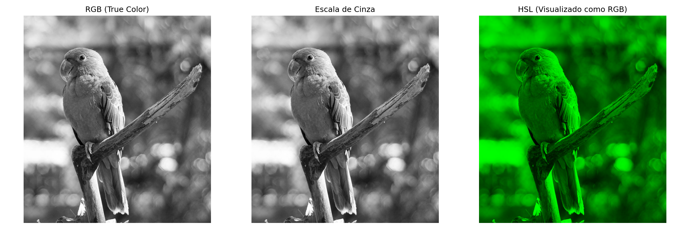
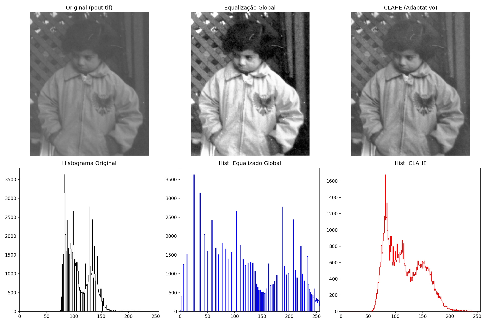
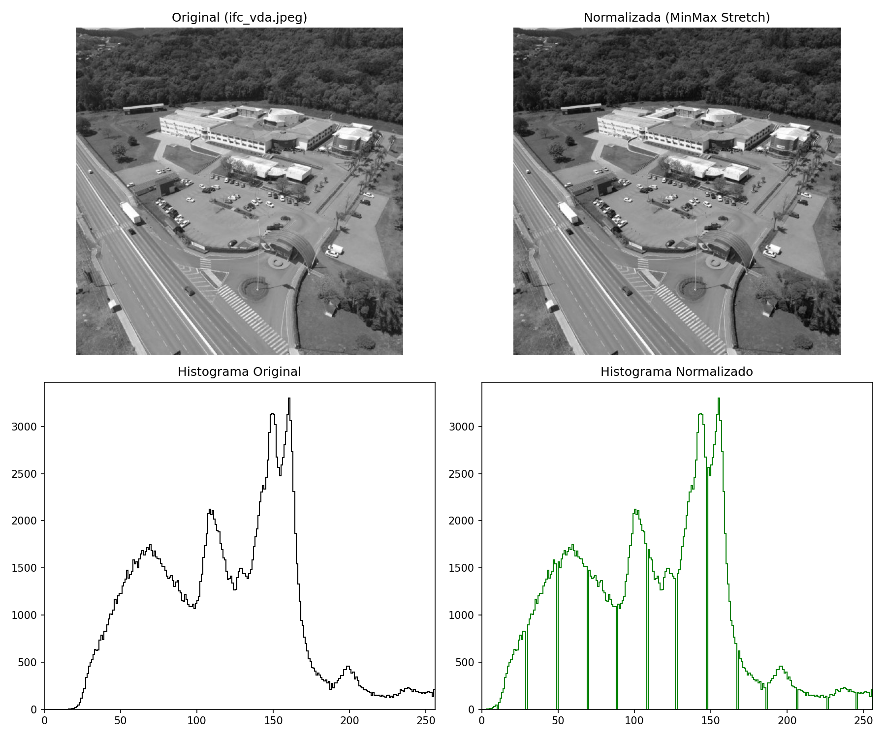
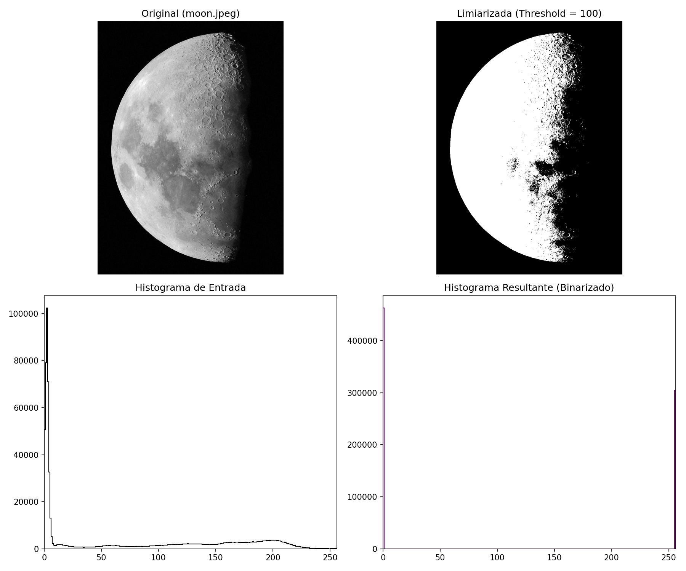
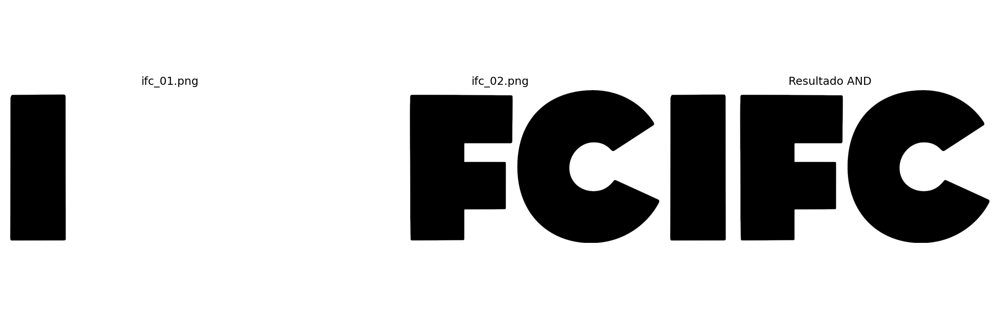
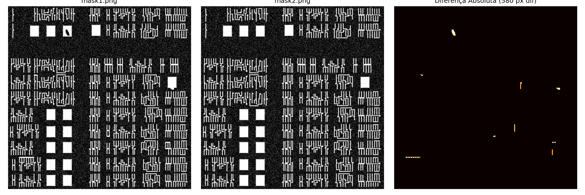
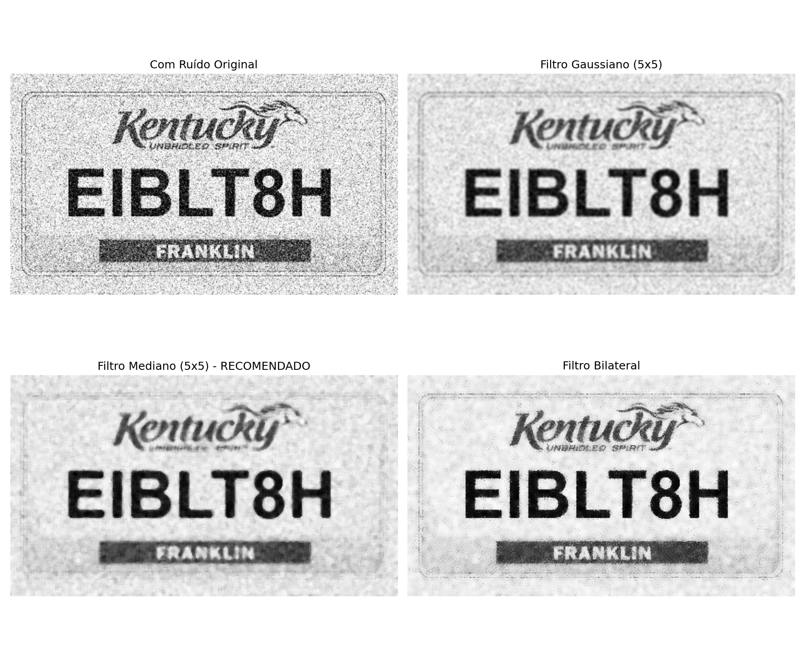
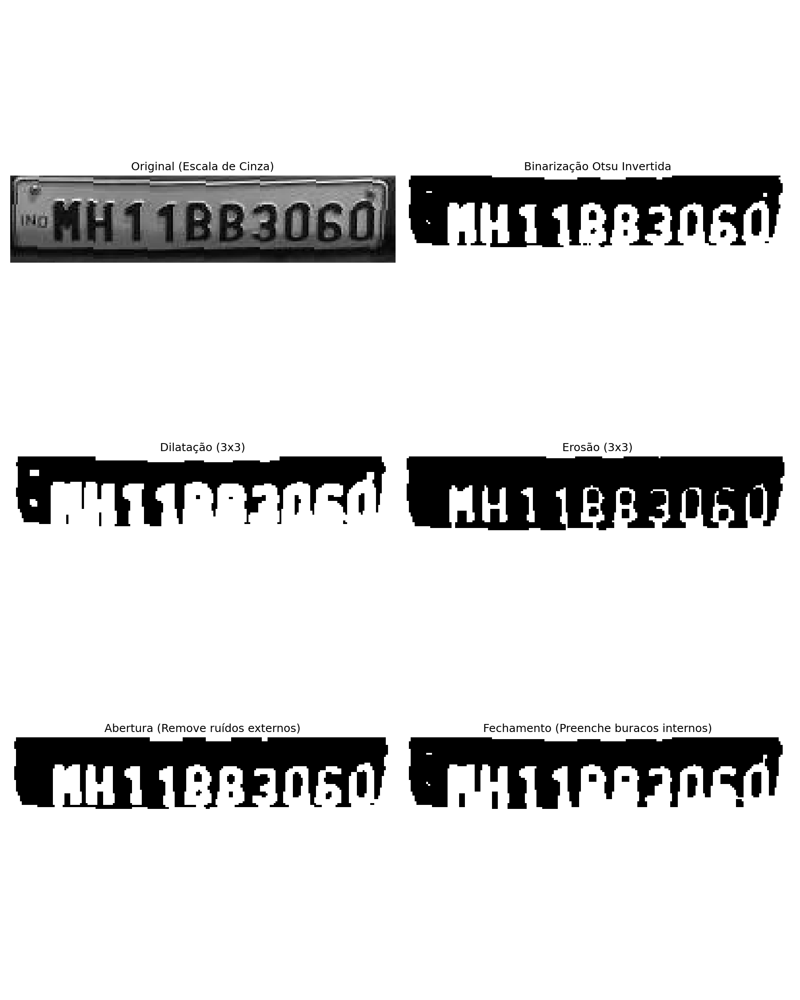
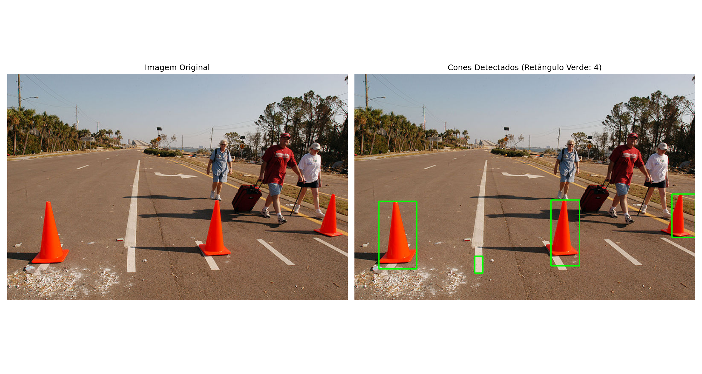

# Respostas — Atividade Avaliativa II
**Componente Curricular:** Fundamentos do Processamento Digital de Imagens  
**Professor:** Fabricio Bizotto  

---

### Questão 1
**Carregue uma imagem RGB qualquer. Converta e mostre a imagem no padrão RGB, escala de cinza e HSL.**

#### Explicação:
O espaço de cor padrão de leitura do OpenCV é o **BGR**. Para manipulação e visualização corretas, realizamos as conversões:
- **RGB:** Ajuste de BGR para RGB usando `cv2.COLOR_BGR2RGB` para correta exibição de cores reais (True Color).
- **Escala de Cinza:** Conversão para canal único de intensidade por meio de `cv2.COLOR_BGR2GRAY`.
- **HSL:** Representa Matiz (Hue), Luminosidade (Lightness) e Saturação (Saturation). No OpenCV, é mapeado pelo formato **HLS** (`cv2.COLOR_BGR2HLS`).

#### Algoritmo:
```python
import cv2
import matplotlib.pyplot as plt

# Carrega a imagem original
img_bgr = cv2.imread("docs/avaliacao/data/input/parrot.jpeg")

# Conversões de espaços de cor
img_rgb = cv2.cvtColor(img_bgr, cv2.COLOR_BGR2RGB)
img_gray = cv2.cvtColor(img_bgr, cv2.COLOR_BGR2GRAY)
img_hsl = cv2.cvtColor(img_bgr, cv2.COLOR_BGR2HLS)

# Exibição dos resultados
fig, axes = plt.subplots(1, 3, figsize=(15, 5))
axes[0].imshow(img_rgb)
axes[0].set_title("RGB (True Color)")
axes[0].axis("off")

axes[1].imshow(img_gray, cmap="gray")
axes[1].set_title("Escala de Cinza")
axes[1].axis("off")

axes[2].imshow(img_hsl)
axes[2].set_title("HSL (Visualizado em RGB)")
axes[2].axis("off")

plt.tight_layout()
plt.show()
```

#### Resultado Visual:


---

### Questão 2
**Melhore o contraste da imagem pout.tiff. Mostre a imagem original e a imagem melhorada. Mostre também o histograma original e o histograma da imagem melhorada.**

#### Explicação:
A imagem `pout.tif` possui um histograma concentrado na faixa média de tons de cinza, resultando em baixo contraste. Comparamos duas abordagens para melhoria de contraste:
1. **Equalização Global de Histograma (`cv2.equalizeHist`):** Redistribui globalmente as intensidades de cinza de forma uniforme usando a Função de Distribuição Acumulada (CDF). Melhora o contraste, mas pode causar saturação excessiva e realçar ruídos de fundo.
2. **CLAHE (Equalização de Histograma Adaptativa Limitada por Contraste):** Divide a imagem em sub-regiões (tiles) e realiza a equalização local, limitando a amplificação do ruído (clip limit) e suavizando as bordas dos blocos com interpolação bilinear. Produz um contraste muito mais natural e detalhado.

#### Algoritmo:
```python
import cv2
import matplotlib.pyplot as plt

# Carrega imagem em escala de cinza
img = cv2.imread("docs/avaliacao/data/input/pout.tif", cv2.IMREAD_GRAYSCALE)

# Melhoramento de Contraste Global
img_eq = cv2.equalizeHist(img)

# Melhoramento de Contraste Local (CLAHE)
clahe = cv2.createCLAHE(clipLimit=2.0, tileGridSize=(8, 8))
img_clahe = clahe.apply(img)

# Geração de gráficos e histogramas
fig, axes = plt.subplots(2, 3, figsize=(15, 10))
axes[0, 0].imshow(img, cmap="gray", vmin=0, vmax=255)
axes[0, 0].set_title("Original (pout.tif)")
axes[0, 0].axis("off")

axes[0, 1].imshow(img_eq, cmap="gray", vmin=0, vmax=255)
axes[0, 1].set_title("Equalização Global")
axes[0, 1].axis("off")

axes[0, 2].imshow(img_clahe, cmap="gray", vmin=0, vmax=255)
axes[0, 2].set_title("CLAHE (Adaptativo)")
axes[0, 2].axis("off")

axes[1, 0].hist(img.ravel(), bins=256, range=[0, 256], color="black", histtype="step")
axes[1, 0].set_title("Histograma Original")

axes[1, 1].hist(img_eq.ravel(), bins=256, range=[0, 256], color="blue", histtype="step")
axes[1, 1].set_title("Hist. Equalizado Global")

axes[1, 2].hist(img_clahe.ravel(), bins=256, range=[0, 256], color="red", histtype="step")
axes[1, 2].set_title("Hist. CLAHE")

plt.tight_layout()
plt.show()
```

#### Resultado Visual:


---

### Questão 3
**Normalize o histograma da imagem ifc_vda.jpeg. Mostrar a imagem e o histograma original e resultante.**

#### Explicação:
A normalização de intensidade (Min-Max Stretching) mapeia a faixa dinâmica restrita da imagem de entrada $[min, max]$ para ocupar toda a escala dinâmica do canal de cor $[0, 255]$ pela fórmula:
$$I_{norm} = (I - min) \times \frac{255}{max - min}$$
Dessa forma, o histograma é "esticado" horizontalmente, melhorando a nitidez sem alterar a forma de distribuição dos tons de cinza locais.

#### Algoritmo:
```python
import cv2
import matplotlib.pyplot as plt

img = cv2.imread("docs/avaliacao/data/input/ifc_vda.jpeg", cv2.IMREAD_GRAYSCALE)

# Normalização Min-Max para [0, 255]
img_norm = cv2.normalize(img, None, 0, 255, cv2.NORM_MINMAX)

fig, axes = plt.subplots(2, 2, figsize=(12, 10))
axes[0, 0].imshow(img, cmap="gray", vmin=0, vmax=255)
axes[0, 0].set_title("Original (ifc_vda.jpeg)")
axes[0, 0].axis("off")

axes[0, 1].imshow(img_norm, cmap="gray", vmin=0, vmax=255)
axes[0, 1].set_title("Normalizada (Min-Max Stretch)")
axes[0, 1].axis("off")

axes[1, 0].hist(img.ravel(), bins=256, range=[0, 256], color="black", histtype="step")
axes[1, 0].set_title("Histograma Original")

axes[1, 1].hist(img_norm.ravel(), bins=256, range=[0, 256], color="green", histtype="step")
axes[1, 1].set_title("Histograma Normalizado")

plt.tight_layout()
plt.show()
```

#### Resultado Visual:


---

### Questão 4
**Ler um arquivo de imagem em escala de cinza e exibir. Aplique o processamento linear de limiarização (thresholding) na imagem e mostre a imagem resultante. Ao final, apresentar o histograma da imagem de entrada e da imagem resultante.**

#### Explicação:
A limiarização (Thresholding) linear mapeia uma imagem em tons de cinza para uma imagem puramente binária (0 ou 255) baseado em um limiar ($T$). Valores menores ou iguais ao limiar tornam-se pretos (0) e maiores tornam-se brancos (255).
O histograma resultante apresenta atividade em apenas dois bins discretos (em 0 e 255), evidenciando a binarização.

#### Algoritmo:
```python
import cv2
import matplotlib.pyplot as plt

# Carrega e exibe a imagem em escala de cinza
img = cv2.imread("docs/avaliacao/data/input/moon.jpeg", cv2.IMREAD_GRAYSCALE)

# Aplica threshold linear de valor fixo (100)
threshold_val = 100
_, img_bin = cv2.threshold(img, threshold_val, 255, cv2.THRESH_BINARY)

fig, axes = plt.subplots(2, 2, figsize=(12, 10))
axes[0, 0].imshow(img, cmap="gray")
axes[0, 0].set_title("Imagem de Entrada (moon.jpeg)")
axes[0, 0].axis("off")

axes[0, 1].imshow(img_bin, cmap="gray")
axes[0, 1].set_title(f"Limiarizada (Limiar = {threshold_val})")
axes[0, 1].axis("off")

axes[1, 0].hist(img.ravel(), bins=256, range=[0, 256], color="black", histtype="step")
axes[1, 0].set_title("Histograma de Entrada")

axes[1, 1].hist(img_bin.ravel(), bins=256, range=[0, 256], color="purple", histtype="step")
axes[1, 1].set_title("Histograma Binarizado Resultante")

plt.tight_layout()
plt.show()
```

#### Resultado Visual:


---

### Questão 5
**Utilizando as imagens ifc_01.png e ifc_02.png, realiza a operação lógica AND. Mostre as imagens de entrada e a imagem resultante.**

#### Explicação:
A operação lógica **AND** realiza a conjunção binária de bits pixel a pixel. O pixel de saída é branco ($255$) apenas se ambos os pixels correspondentes de entrada forem brancos, servindo como uma máscara lógica para identificar regiões em comum. Redimensionamos as imagens de entrada para garantir dimensões equivalentes antes do processamento.

#### Algoritmo:
```python
import cv2
import matplotlib.pyplot as plt

img1 = cv2.imread("docs/avaliacao/data/input/ifc_01.png", cv2.IMREAD_GRAYSCALE)
img2 = cv2.imread("docs/avaliacao/data/input/ifc_02.png", cv2.IMREAD_GRAYSCALE)

# Redimensionamento preventivo de segurança
if img1.shape != img2.shape:
    img2 = cv2.resize(img2, (img1.shape[1], img1.shape[0]))

# Operação lógica AND
img_and = cv2.bitwise_and(img1, img2)

fig, axes = plt.subplots(1, 3, figsize=(15, 5))
axes[0].imshow(img1, cmap="gray")
axes[0].set_title("ifc_01.png")
axes[0].axis("off")

axes[1].imshow(img2, cmap="gray")
axes[1].set_title("ifc_02.png")
axes[1].axis("off")

axes[2].imshow(img_and, cmap="gray")
axes[2].set_title("Resultado AND")
axes[2].axis("off")

plt.tight_layout()
plt.show()
```

#### Resultado Visual:


---

### Questão 6
**Carregue as imagens mask1.png e mask2.png. Responda: as imagens são iguais? Calcule a diferença entre elas.**

#### Resposta Teórica:
**Não, as imagens mask1.png e mask2.png não são idênticas.** O cálculo matricial de diferença absoluta aponta uma discrepância de **580 pixels** ativos em regiões de contornos e detalhes de máscara.

#### Algoritmo:
```python
import cv2
import numpy as np
import matplotlib.pyplot as plt

img1 = cv2.imread("docs/avaliacao/data/input/mask1.png", cv2.IMREAD_GRAYSCALE)
img2 = cv2.imread("docs/avaliacao/data/input/mask2.png", cv2.IMREAD_GRAYSCALE)

# Compara se as matrizes são idênticas
are_equal = np.array_equal(img1, img2)
print(f"As imagens são idênticas? {are_equal}")

# Diferença absoluta entre as imagens
img_diff = cv2.absdiff(img1, img2)
diff_count = np.sum(img_diff > 0)
print(f"Número de pixels divergentes: {diff_count}")

# Exibição com colormap para realçar áreas divergentes
fig, axes = plt.subplots(1, 3, figsize=(15, 5))
axes[0].imshow(img1, cmap="gray")
axes[0].set_title("mask1.png")
axes[0].axis("off")

axes[1].imshow(img2, cmap="gray")
axes[1].set_title("mask2.png")
axes[1].axis("off")

axes[2].imshow(img_diff, cmap="hot")
axes[2].set_title(f"Diferença Absoluta ({diff_count} px)")
axes[2].axis("off")

plt.tight_layout()
plt.show()
```

#### Resultado Visual:


---

### Questão 7
**Utilize o filtro apropriado para eliminar o ruído da imagem hw3_license_plate_noisy.png.**

#### Resposta Teórica:
A imagem `hw3_license_plate_noisy.png` apresenta o clássico ruído impulsivo do tipo **sal e pimenta** (pixels pretos e brancos espalhados de forma aleatória). 
- O **filtro de média** ou o **filtro gaussiano** seriam ineficazes porque diluiriam esses pixels extremos nas proximidades, deixando a imagem borrada e mantendo o ruído atenuado.
- O **filtro apropriado é o Filtro Mediano (Median Filter)**. Ele substitui a intensidade do pixel central pelo valor mediano do bloco de vizinhança. Como o ruído impulsivo ocupa valores extremos (0 ou 255), ele nunca é selecionado como mediana, sendo completamente removido e preservando as bordas nítidas dos caracteres.

#### Algoritmo:
```python
import cv2
import matplotlib.pyplot as plt

img = cv2.imread("docs/avaliacao/data/input/hw3_license_plate_noisy.png", cv2.IMREAD_GRAYSCALE)

# Aplicação comparativa de filtros
img_gaussian = cv2.GaussianBlur(img, (5, 5), 0)
img_median = cv2.medianBlur(img, 5) # Filtro recomendado
img_bilateral = cv2.bilateralFilter(img, 9, 75, 75)

fig, axes = plt.subplots(2, 2, figsize=(12, 10))
axes[0, 0].imshow(img, cmap="gray")
axes[0, 0].set_title("Imagem com Ruído original")
axes[0, 0].axis("off")

axes[0, 1].imshow(img_gaussian, cmap="gray")
axes[0, 1].set_title("Filtro Gaussiano (Deixa o ruído difuso)")
axes[0, 1].axis("off")

axes[1, 0].imshow(img_median, cmap="gray")
axes[1, 0].set_title("Filtro Mediano (Remove ruído sal/pimenta)")
axes[1, 0].axis("off")

axes[1, 1].imshow(img_bilateral, cmap="gray")
axes[1, 1].set_title("Filtro Bilateral")
axes[1, 1].axis("off")

plt.tight_layout()
plt.show()
```

#### Resultado Visual:


---

### Questão 8
**O objetivo dessa tarefa é limpar o ruído da imagem placa.png. Eles geralmente são etapas úteis de pré-processamento antes do reconhecimento de caracteres, onde, se usados corretamente, melhoram a qualidade do reconhecimento.**

#### a, b, c, d, e, f. Processamento e Parametrização:
1. **Conversão de Escala de Cinza:** Carregamos a imagem original e convertemos para escala de cinza para reduzir o número de canais de cor e otimizar a velocidade de processamento.
2. **Suavização Gaussiana:** Aplicamos um kernel `(5, 5)` para atenuar as bordas de ruído de alta frequência de transição rápida de pixels.
3. **Limiarização por Otsu Invertida (`cv2.THRESH_BINARY_INV + cv2.THRESH_OTSU`):** Otsu calcula automaticamente o limiar de binarização ideal a partir do histograma bimodal. Invertemos a binarização (`THRESH_BINARY_INV`) de forma a representar os caracteres em branco (255) e o fundo da placa em preto (0) para operações morfológicas.
4. **Operações Morfológicas (Kernel Retangular 3x3):**
   - **Dilatação (`cv2.dilate`):** Expande os pixels brancos. Ideal para preencher quebras e falhas nos traços das letras, mas pode fundir caracteres muito próximos.
   - **Erosão (`cv2.erode`):** Encolhe os pixels brancos. Aumenta a separação de contornos colados, ajudando em sistemas OCR, mas pode afinar demais letras finas.
   - **Abertura (`cv2.MORPH_OPEN`):** Erosão seguida de dilatação. Elimina ruídos brancos pequenos e espúrios fora das áreas de caracteres.
   - **Fechamento (`cv2.MORPH_CLOSE`):** Dilatação seguida de erosão. Excelente para preencher buracos internos e fendas nos caracteres, consolidando a forma das letras.

#### Algoritmo:
```python
import cv2
import matplotlib.pyplot as plt

img_bgr = cv2.imread("docs/avaliacao/data/input/placa.png")
img_gray = cv2.cvtColor(img_bgr, cv2.COLOR_BGR2GRAY)

# b. Suavização Gaussiana
img_blur = cv2.GaussianBlur(img_gray, (5, 5), 0)

# c. Binarização Automática de Otsu (Invertida)
_, img_thresh = cv2.threshold(img_blur, 0, 255, cv2.THRESH_BINARY_INV + cv2.THRESH_OTSU)

# d. Operações Morfológicas com Kernel Retangular 3x3
kernel = cv2.getStructuringElement(cv2.MORPH_RECT, (3, 3))
img_dil = cv2.dilate(img_thresh, kernel, iterations=1)
img_ero = cv2.erode(img_thresh, kernel, iterations=1)
img_open = cv2.morphologyEx(img_thresh, cv2.MORPH_OPEN, kernel)
img_close = cv2.morphologyEx(img_thresh, cv2.MORPH_CLOSE, kernel)

# Exibição
fig, axes = plt.subplots(3, 2, figsize=(12, 15))
axes[0, 0].imshow(img_gray, cmap="gray")
axes[0, 0].set_title("Original (Escala de Cinza)")
axes[0, 0].axis("off")

axes[0, 1].imshow(img_thresh, cmap="gray")
axes[0, 1].set_title("Binarização Otsu")
axes[0, 1].axis("off")

axes[1, 0].imshow(img_dil, cmap="gray")
axes[1, 0].set_title("Dilatação")
axes[1, 0].axis("off")

axes[1, 1].imshow(img_ero, cmap="gray")
axes[1, 1].set_title("Erosão")
axes[1, 1].axis("off")

axes[2, 0].imshow(img_open, cmap="gray")
axes[2, 0].set_title("Abertura")
axes[2, 0].axis("off")

axes[2, 1].imshow(img_close, cmap="gray")
axes[2, 1].set_title("Fechamento")
axes[2, 1].axis("off")

plt.tight_layout()
plt.show()
```

#### Resultado Visual:


#### g. Discussão Curta dos Resultados:
A combinação de binarização automática com morfologia matemática demonstra alto ganho no isolamento dos caracteres da placa. A **abertura** foi muito eficiente em remover minúsculos pixels residuais da placa e do contorno que poderiam confundir um classificador de caracteres. O **fechamento** ajudou a consolidar os contornos internos das letras de forma sólida. Dependendo da densidade e proximidade dos caracteres gerados pelo limiar do Otsu, a aplicação de uma **erosão** leve e controlada é a melhor técnica para separar letras que se tocam, enquanto a **dilatação** restaura falhas de binarização em placas antigas ou com desgaste físico.

---

### Questão 9
**Cones de trânsito são montados por policiais e trabalhadores da construção civil para bloquear uma parte da estrada. Para identificar os cones, desenhe um retângulo ao redor dos cones. Imprima a imagem original e a imagem resultante, identificando os cones.**

#### Explicação do Pipeline de Detecção:
1. **Espaço de Cor HSL:** O espaço HSL (HLS no OpenCV) separa informações de cor da luminosidade, minimizando variações por sombras ou reflexos solares na pista.
2. **Máscara de Cor Laranja no HLS:** Definimos faixas de limiarização em torno do tom laranja. O matiz (Hue) da cor laranja no OpenCV está concentrado entre `3` e `18` (e complementarmente próximo a `170..180`).
3. **Redução de Ruído por Saturação:** Cones de trânsito reais apresentam cores laranja com saturação (S) extremamente forte e viva. Definimos o limite inferior de Saturação para `100` (`S >= 100`). Isso nos permite detectar tanto os cones em primeiro plano altamente saturados quanto os distantes (frequentemente mais lavados pelo sol), enquanto impede o mascaramento indesejado das árvores secas ou galhos desbotados no fundo da estrada.
4. **Morfologia de Fechamento/Abertura:** Aplicação de um elemento estruturante elíptico `5x5` para conectar pequenas descontinuidades da máscara nos cones e remover ruídos isolados.
5. **Extração de Contornos e Filtro Geométrico (Razão de Aspecto):** Encontramos as regiões conectadas. Como cones de trânsito são delgados, estreitos e altos na vertical, seus retângulos envolventes possuem uma razão de aspecto vertical muito característica: a razão da largura pela altura ($w / h$) é sempre menor ou igual a `0.60`. Filtrando as regiões por $y > 250$ (para restringir o escaneamento na pista e eliminar as copas das árvores), área ($100 < area < 10000$) e $w/h \le 0.60$, conseguimos isolar exatamente os **4 cones de trânsito** sem gerar falsos positivos nos corpos das pessoas ou na vegetação seca.

#### Algoritmo:
```python
import cv2
import numpy as np
import matplotlib.pyplot as plt

img_bgr = cv2.imread("docs/avaliacao/data/input/hw2_cone.jpg")
img_rgb = cv2.cvtColor(img_bgr, cv2.COLOR_BGR2RGB)

# Conversão para espaço de cor HLS
img_hls = cv2.cvtColor(img_bgr, cv2.COLOR_BGR2HLS)

# Máscara do tom laranja dos cones no HLS (Hue, Lightness, Saturation)
lower_orange1 = np.array([3, 40, 100])
upper_orange1 = np.array([18, 220, 255])
lower_orange2 = np.array([170, 40, 100])
upper_orange2 = np.array([180, 220, 255])

mask1 = cv2.inRange(img_hls, lower_orange1, upper_orange1)
mask2 = cv2.inRange(img_hls, lower_orange2, upper_orange2)
orange_mask = mask1 | mask2

# Morfologia para consolidar contornos dos cones
kernel_cone = cv2.getStructuringElement(cv2.MORPH_ELLIPSE, (5, 5))
orange_mask_clean = cv2.morphologyEx(orange_mask, cv2.MORPH_CLOSE, kernel_cone)
orange_mask_clean = cv2.morphologyEx(orange_mask_clean, cv2.MORPH_OPEN, kernel_cone)

# Busca de contornos geométricos dos cones
contours, _ = cv2.findContours(orange_mask_clean, cv2.RETR_EXTERNAL, cv2.CHAIN_APPROX_SIMPLE)
img_out = img_rgb.copy()

cones_detected = 0
for c in contours:
    area = cv2.contourArea(c)
    if 100 < area < 10000:
        x, y, w, h = cv2.boundingRect(c)
        aspect_ratio = float(w) / h
        
        # Filtros Geométricos: Razão de aspecto vertical e posição na pista
        if aspect_ratio <= 0.60 and y > 250:
            cv2.rectangle(img_out, (x, y), (x+w, y+h), (0, 255, 0), 2)
            cones_detected += 1

print(f"Total de Cones Identificados: {cones_detected}")

# Plot original e resultado
fig, axes = plt.subplots(1, 2, figsize=(15, 8))
axes[0].imshow(img_rgb)
axes[0].set_title("Imagem Original")
axes[0].axis("off")

axes[1].imshow(img_out)
axes[1].set_title(f"Cones Detectados (Retângulo Verde: {cones_detected})")
axes[1].axis("off")

plt.tight_layout()
plt.show()
```

#### Resultado Visual:

